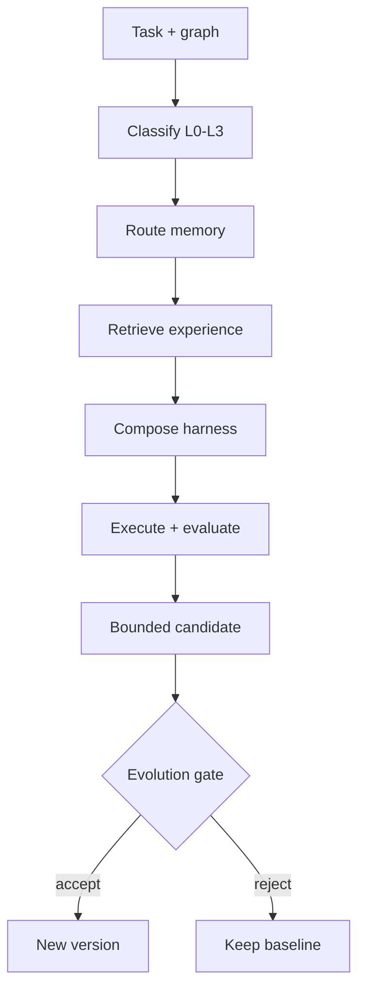

# Harness composition and safe evolution

SpecJam treats the harness as a versioned engineering artifact. It may adapt to
a task, but it cannot silently rewrite its own accepted policy.



## Planner contract

`HarnessPlanner` composes a deterministic configuration from the canonical flow
graph, stage, task classification, resolved skill versions, available tools,
memory policy, and selected experience IDs.

Memory routing is proportional:

| Level | Planning | Memory |
| --- | --- | --- |
| L0 | direct | off |
| L1 | direct with validation | at most one item / 4,000 characters |
| L2 | staged | configured policy |
| L3 | hierarchical | at least five items / 16,000 characters |

The graph remains authoritative. Composition cannot skip its agent, required
artifacts, reviewers, or session retry policy. The resulting `harness-<digest>`
version is content-addressed and travels in `SessionRequest.metadata` with the
complete config. Loading a serialized config verifies its digest and rejects
unknown fields.

## Candidate boundary

`HarnessOptimizer` creates a new immutable config and records the baseline as
`parent_version`. A proposal requires a hypothesis and evidence references. It
may change only execution primitives such as tools, skills, context, memory,
planning, evaluation, recovery, retry policy, or agent. Flow, graph version,
stage, task level, and schema identity cannot change through evolution.

By default, one candidate may modify at most three primitives. This makes credit
assignment possible: a giant rewrite that happens to pass once is not learning.

## Evolution gate

The gate compares baseline and candidate observations independently:

- task success;
- artifact quality;
- constraint adherence;
- full regression pass rate;
- generalization score;
- aggregate and per-component quality regression;
- cost and latency increase;
- human intervention increase;
- meaningful and bounded primitive changes.

Every check is returned with its observed value and required threshold. The
decision is accepted only when all checks pass. A stricter workspace may require
a positive `min_quality_improvement`; the default still forbids any quality
regression.

## CLI workflow

Compose a baseline:

```bash
specjam harness compose \
  --graph .specjam/graphs/delivery-graph.json \
  --stage build \
  --objective "Implement payment API" \
  --tool git --tool tests \
  --project cards --repository org/cards-api \
  > baseline.json
```

Describe one focused change:

```json
{
  "recovery_strategy": "diagnose-retrieve-and-replan"
}
```

Create an evidenced candidate:

```bash
specjam harness propose \
  --baseline baseline.json \
  --changes changes.json \
  --hypothesis "Targeted retrieval improves failed replans" \
  --evidence-ref benchmark://recovery-suite/42 \
  > candidate.json
```

Gate it using measured baseline and candidate metrics:

```bash
specjam harness gate \
  --candidate candidate.json \
  --baseline-metrics baseline-metrics.json \
  --candidate-metrics candidate-metrics.json
```

Accepted candidates return exit code `0`; rejected candidates return `3`, so the
same command can guard promotion in CI. Acceptance is a decision, not an
automatic deployment—the consuming workspace still owns promotion and rollback.
